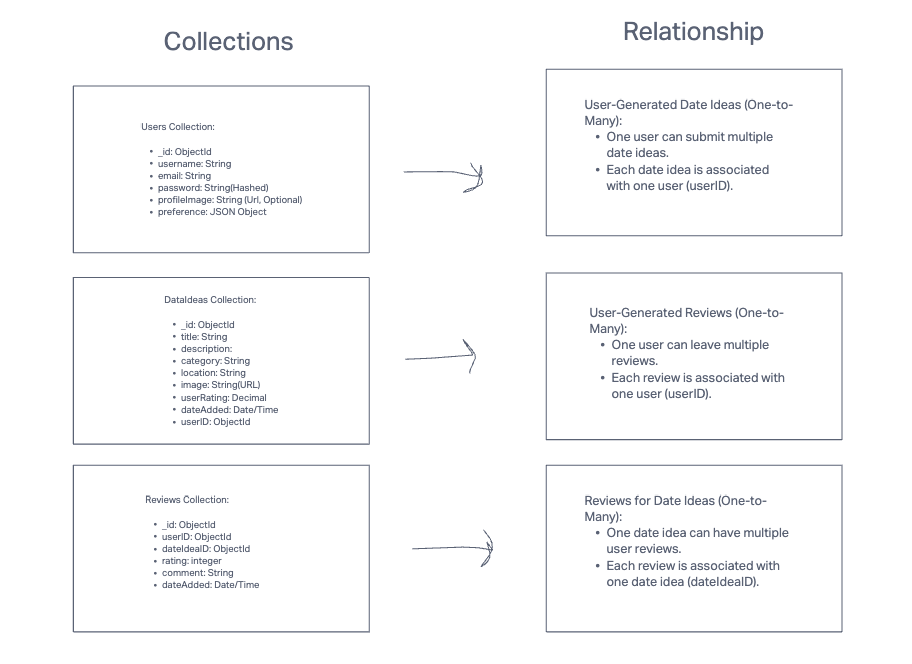

# Gemsy

## Creators

- Alejandra Altamirano
- Josh Shea
- Sydney Pagalan
- Samaad Turner

## Description

> ***Gemsy*** is a web application designed to help couples discover unique and romantic date ideas, including hidden gem restaurants and activities in their local area or travel destinations. Users can explore authentic and off-the-beaten-path experiences that are perfect for creating memorable moments with their loved ones.

## Wireframe

## User Stories

[Trello](https://trello.com/b/fP1HpmOs/gemsy)

## Domain Modeling

> Our domain modeling can be found in our invisionapp sketch located here:
[Domain Modeling](insert link here)

## Database Modeling

## Lighthouse

### References

- ChatGPT and other AI models were used to suggest, correct and explain code.
